# Chrome V8 Type Confusion Zero-Day: CVE-2025-10585 - Detailed Code Analysis and Visual Examination

**Publication Date: September 20, 2025**  
  

Google Chrome stands as the default browser for billions of users worldwide, positioning it at the forefront of web security. However, one of the most critical zero-day vulnerabilities of 2025, **CVE-2025-10585**, has exposed a type confusion flaw in Chrome's V8 JavaScript and WebAssembly engine. This vulnerability, identified by Google's Threat Analysis Group (TAG) on September 16, 2025, represents the sixth actively exploited Chrome zero-day of the year. It highlights the ongoing challenges in balancing high-performance JavaScript execution with robust security measures.

Type confusion vulnerabilities in V8 are particularly insidious because they exploit the engine's dynamic type system and just-in-time (JIT) compilation optimizations. In this case, the flaw allows attackers to manipulate object types during code execution, leading to memory corruption that can escalate to arbitrary code execution. The vulnerability's "in the wild" exploitation status underscores its real-world impact, with reports linking it to state-sponsored actors and commercial spyware campaigns. Affected versions include all Chrome releases prior to 140.0.7339.185 across Windows, Linux, and macOS platforms, as well as Chromium-based browsers like Microsoft Edge and Brave.

This article provides an in-depth examination of the vulnerability's technical origins, code-level analysis, exploitation mechanisms, and visual representations through flowcharts and diagrams. Drawing from Google's official disclosures and independent security research, we aim to equip developers, security professionals, and users with a comprehensive understanding of this threat. The analysis emphasizes how subtle optimizations in V8's TurboFan compiler can create exploitable gaps, serving as a case study in modern browser security.

## Impact Summary

| Attribute | Description | Risk Level |
|-----------|-------------|------------|
| **CVSS v3.1 Score** | 8.8 (High) - Network-based, low complexity, high impact (NIST estimate; official score pending) | 🔥🔥🔥🔥 |
| **Affected Products** | Google Chrome < 140.0.7339.185 (Windows/Linux/macOS); Chromium-based browsers (Edge, Brave, etc.) | |
| **Exploitation Condition** | User visits a malicious web page (potential for sandbox escape) | |
| **Potential Damage** | Remote Code Execution (RCE), memory leaks, sandbox bypass; crypto wallet draining and private key theft | |
| **Exploitation Status** | Active in-the-wild exploits (confirmed by Google TAG); used by nation-state actors and commercial spyware | |

## Vulnerability Origin: V8 Type Confusion Mechanism

V8, Chrome's open-source JavaScript engine, employs Just-In-Time (JIT) compilation for superior performance. Type confusion arises from weaknesses in V8's type system: the TurboFan compiler makes assumptions about types during optimization, but attackers can subvert these assumptions, causing memory objects to be misinterpreted.

### Technical Explanation
- **Trigger:** An attacker crafts a JavaScript object (e.g., Proxy or WeakMap) to deceive V8's inline cache (IC) mechanism. This results in an object being treated as an unexpected type (e.g., number instead of array).
- **Memory Impact:** The incorrect type interpretation paves the way for heap buffer overflows or use-after-free scenarios, enabling attackers to construct Return-Oriented Programming (ROP) chains.
- **Why Dangerous?** Even within V8's sandbox, this vulnerability can chain with others (e.g., CVE-2025-10500) to escape the renderer process and achieve system-level access.

### Type Confusion Flow Diagram


## Code Analysis: The Inner Workings of Type Confusion

In V8's source code (GitHub: v8/v8), type confusion often stems from errors in type inference within files like `src/compiler/typer.cc` and `src/interpreter/bytecode-generator.cc`. While a specific Proof-of-Concept (PoC) for this CVE has not been publicly released due to Google's restrictions, we analyze a hypothetical exploit based on similar V8 type confusions (e.g., CVE-2022-1134).

### Step 1: Crafted JavaScript Payload
The attacker uses a Proxy object to corrupt V8's type cache:

```javascript
// Hypothetical PoC Snippet (Adapted from Similar CVEs)
let victim = new Proxy({}, {
  get(target, prop) {
    if (prop === Symbol.toPrimitive) {
      // Type Mismatch: Return array instead of expected number
      return () => [1.1, 2.2, 3.3];  // Float array misinterpreted as number
    }
    return Reflect.get(...arguments);
  }
});

// Optimization Trigger Loop
for (let i = 0; i < 10000; i++) {
  let x = +victim;  // ToNumber() call triggers type confusion
  if (x.length) {  // Incorrect type: numbers don't have length!
    // Memory Read: x[0] enables arbitrary read
    console.log(x[0]);  // Heap leak
  }
}
```

**Analysis:** The `+victim` operator invokes the `ToNumber()` primitive. If the Proxy returns an unexpected array, V8's Maglev/TurboFan compiler loses type feedback, corrupting the IC cache. This leads to incorrect offsets in `heapobject` pointers.

### Step 2: Disassembly and Memory Visualization
In V8's compiled bytecode (via d8 debugger), the type confusion appears as:

```assembly
; Pseudo-Assembly (V8 TurboFan Output)
0x12345678:  mov rax, [rdi + 0x10]  ; Load object type (expected: Number)
0x1234567f:  cmp rax, #kNumberTag   ; Type check
0x12345686:  jne 0x12345700         ; Mismatch → Confusion!
0x1234568c:  mov rax, [rdi + 0x08]  ; Incorrect offset: Access array buffer
; Attacker can perform arbitrary write here
```

### Memory Layout Diagram


In this layout, misinterpreting a Proxy as a Number allows the attacker to manipulate the heap.

### Step 3: Exploit Chain
- **Stage 1:** Leak heap pointers (addrof primitive).
- **Stage 2:** Create fake objects (e.g., for WebAssembly).
- **Stage 3:** Build ROP gadgets to load shellcode.

For similar PoC repositories: [nomi-sec/PoC-in-GitHub](https://github.com/nomi-sec/PoC-in-GitHub) – Specific PoC pending.

## Real-World Impacts and Exploitation Examples

Google has confirmed the exploit's "in the wild" status, likely tied to spyware (e.g., similar to NSO Group tools) or cryptocurrency theft. Reports on X (formerly Twitter) indicate victims experiencing wallet drains. Impact: Billions of Chrome users at risk, especially in chained attacks targeting the renderer process.

### Exploit Chain Infographic


## Protection and Patching Strategies

### Emergency Response Plan

```mermaid
flowchart TD
    A["🚨 CVE-2025-10585"] --> B["1. UPDATES:<br/>Chrome 140.0.7339.185+"]
    B --> C["2. UAC/Sandbox Check<br/>(chrome://sandbox)"]
    C --> D["3. Exploit Blocker<br/>(Endpoint Protection)"]
    D --> E["4. JS Disable (Temporary)<br/>(Site Settings)"]
    E --> F["✅ PROTECTION COMPLETE"]
    
    style A fill:#ffebee
    style F fill:#e8f5e8
```



### Immediate Actions
1. **Apply Patch:** Update Chrome: `chrome://settings/help`. Affected versions: < 140.0.7339.185.
2. **Browser Settings:** Disable JS on suspicious sites.
3. **Monitoring IOCs:** Scan network logs for suspicious JS payloads (Proxy loops).

## Resources and Further Reading
- [Google Chrome Release](https://chromereleases.googleblog.com/2025/09/stable-channel-update-for-desktop_17.html)
- [The Hacker News Analysis](https://thehackernews.com/2025/09/google-patches-chrome-zero-day-cve-2025.html)
- [Security Affairs Report](https://securityaffairs.com/182322/uncategorized/cve-2025-10585-is-the-sixth-actively-exploited-chrome-zero-day-patched-by-google-in-2025.html)
- [V8 Source Code](https://github.com/v8/v8) – Examine typer.cc.

## Conclusion

CVE-2025-10585 exemplifies how performance-driven designs in V8 can introduce exploitable security flaws. The code analysis reveals the subtlety of type confusion attacks, emphasizing the need for immediate updates. Stay vigilant for further PoC developments!

**Questions? Leave a comment!**

---

*This article is based on available sources. PoCs are for educational purposes; misuse is illegal.*
